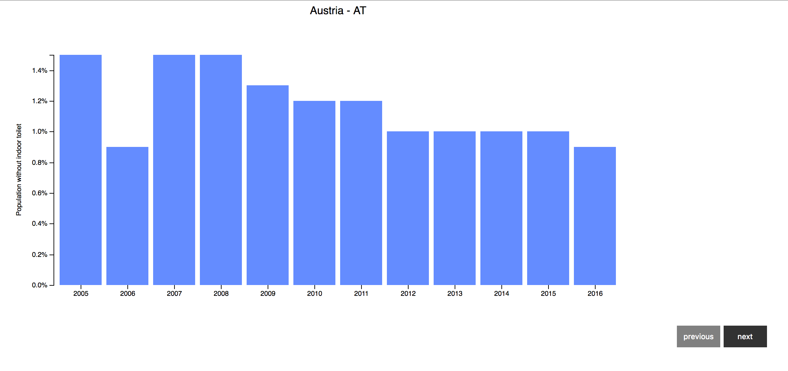

# Assessment - Population without indoor toilet

## Background
This bar chart shows the progress of people who own toilets in different countries. It is interesting that some people do not have a toilet, I hope they will soon! 

After analysing, testing, debugging and a lot of failure, I finally started to get a grip on d3. It really requires a different way of thinking and uses something I have never used before. After asking Joost about d3, he said it was called 'chaining'. Which seems to be very user friendly after working with it. But to be honest, in my opinion it is not very logic if you look at it and compare it to the way people handle things in Javascript. Normally indexing means getting deeper in to an object. But with chaining you only go one layer deep and end up receiving the same object (self) back. I do not know yet if I like chaining, but it is definitely less work.

## Data
After importing the csv file I received this structure:
```js
[
  {
    "year1": <number>,
    "year2": <number>,
    "year3": <number>,
    "code": "CODE",
    "country": "COUNTRY"
  },
  {
    // etc.
  }
]
```
And converted it to this one: (make optimise the readability and code reading speed)

```js
[
  }
    "code": "CODE",
    "country": "COUNTRY",
    "data":[
      {date:<number - year1>, value<number>},
      {date:<number - year2>, value<number>},
      {date:<number - year3>, value<number>},
    ]
  },
  {
    // etc.
  }
]
```

## Features
* **d3.scaleBand()** https://github.com/d3/d3-scale
* **d3.scaleLinear()** https://github.com/d3/d3-scale#continuous-scales
* **domain** https://www.dashingd3js.com/d3js-scales
* **d3.max** https://github.com/d3/d3-3.x-api-reference/blob/master/Arrays.md
* **d3.axisBottom** https://github.com/d3/d3-axis/blob/master/README.md#axisBottom
* **.rangeRound** https://github.com/d3/d3-scale#continuous_rangeRound
* **.on("click",** https://stackoverflow.com/questions/27499864/addeventlistener-to-div-appended-in-d3

## License
Bostock’s, M. (2017, 20 juli). Bar Chart [Source code]. Geraadpleegd van https://bl.ocks.org/mbostock/3885304
Licent: https://opensource.org/licenses/GPL-3.0




[View here!](https://iiyama12.github.io/fe3-assessment-1/index.html)
